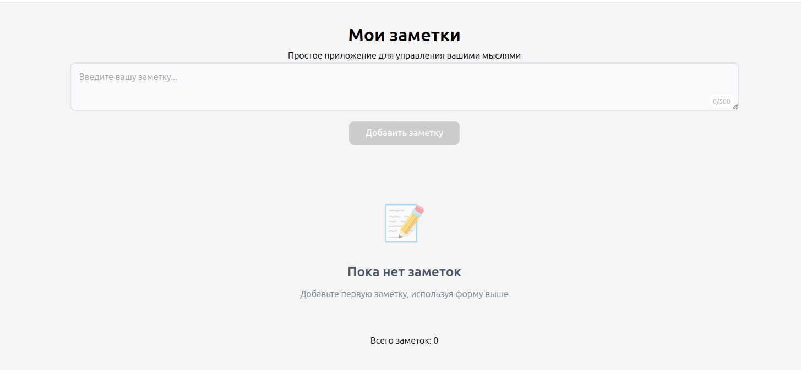
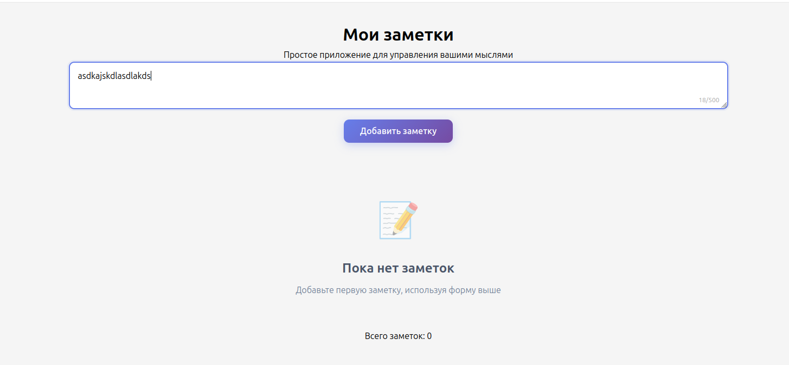
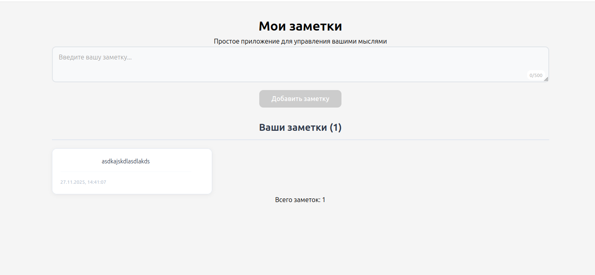
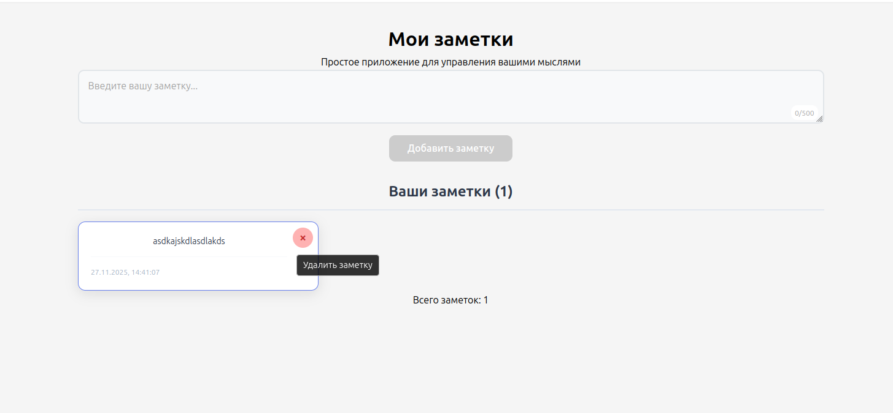

# Краткое описание приложения

Разработано современное веб-приложение "Список заметок" на React, предназначенное для управления текстовыми заметками. Приложение предоставляет пользователю интуитивно понятный интерфейс для создания, просмотра и удаления коротких текстовых записей. Основной фокус приложения — простота использования и минималистичный дизайн, позволяющий пользователю сосредоточиться на содержании заметок.

## 🚀 Функциональность

- ✨ **Добавление заметок** - Быстрое создание новых текстовых заметок
- 👀 **Просмотр списка** - Удобный просмотр всех заметок в виде сетки  
- 🗑️ **Удаление заметок** - Простое удаление с подтверждением
- 💾 **Автосохранение** - Все данные сохраняются в localStorage
- 📱 **Адаптивный дизайн** - Красиво выглядит на всех устройствах
- ✅ **Валидация ввода** - Проверка корректности вводимых данных

## 🎨 Пользовательский интерфейс

- Адаптивный дизайн — корректное отображение на мобильных устройствах и десктопах

- Интерактивные элементы — плавные анимации и визуальные feedback-эффекты

- Визуальный счетчик — отображение количества символов в реальном времени

- Подтверждение действий — диалоговые окна для критических операций

## Особенности реализации
### 🛠️ Технологический стек

1. React 18 — основная библиотека для построения пользовательского интерфейса

2. Vite — современный инструмент сборки для быстрой разработки

3. CSS3 — каскадные таблицы стилей с использованием Flexbox и Grid

4. LocalStorage API — клиентское хранилище данных

5. ES6+ — современные возможности JavaScript


## 🏗️ Структура проекта

```
src/
├── components/              # React компоненты
│   ├── NoteForm/           # Компонент формы добавления
│   │   ├── NoteForm.jsx    # Логика и разметка формы
│   │   └── NoteForm.css    # Стили формы
│   ├── NoteList/           # Компонент списка заметок
│   │   ├── NoteList.jsx    # Логика отображения списка
│   │   └── NoteList.css    # Стили списка
│   └── NoteItem/           # Компонент элемента списка
│       ├── NoteItem.jsx    # Логика отдельной заметки
│       └── NoteItem.css    # Стили элемента
├── App.jsx                 # Корневой компонент приложения
├── App.css                # Глобальные стили приложения
├── main.jsx               # Точка входа
└── index.css              # Базовые стили
```

## Скриншоты Работы программы

### Главный экран


### Добавление заметки


### Список заметок


### Удаление заметки


## Инструкции по запуску

1. Создайте новую папку для проекта
2. Создайте все файлы и папки согласно структуре выше
3. В терминале выполните:
```bash
npm install
npm start